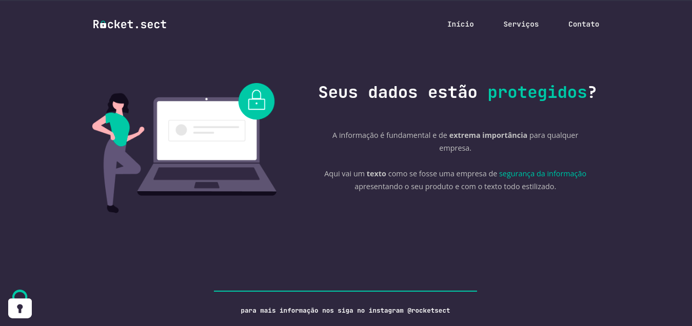

# Recriando layout - Stage 02 (Explorer)

### Linguagens usadas: HTML e CSS

=> Nesse desafio tinhamos que recriar uma aplicação, a partir de um layout, servindo para o treinamento do que foi ensinado até agora no Stage 02.

 

## Projeto finalizado

